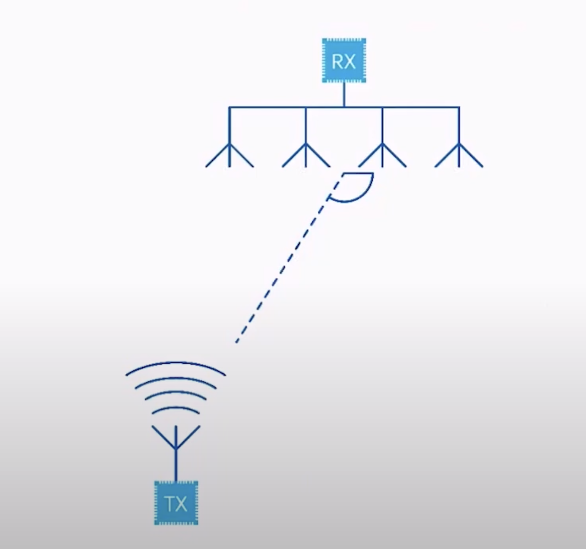
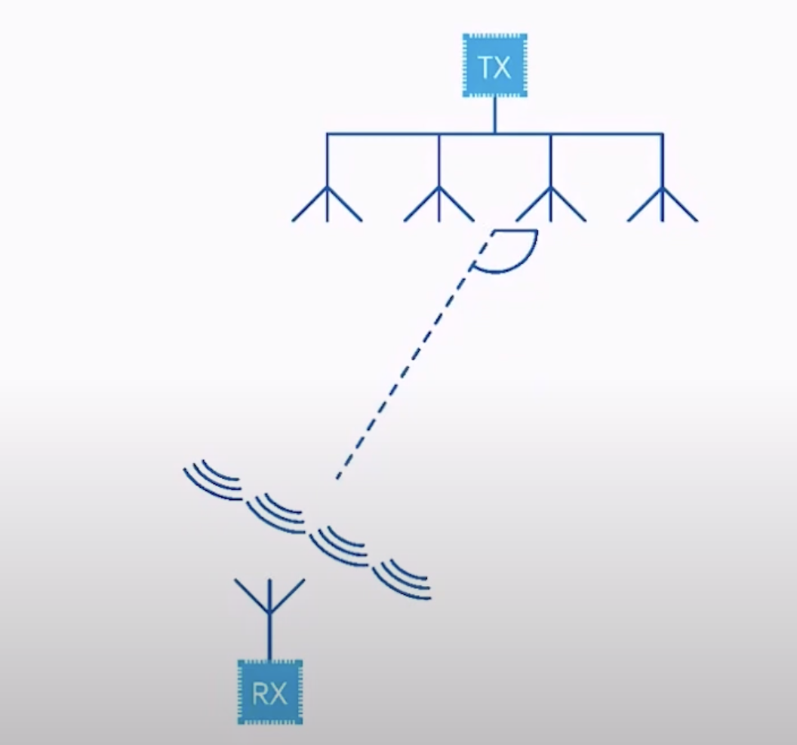

### Basics
- Wireless Personal Area Network Technology
- Efficient and Ultra-low Power
    - Small packets and short RX and TX Window
    - Use radio as little as possible
- Low RAM footprint
- Up to 1.4 Mbps thoughput or more than 1000 m range
#### Evolution of Bluetooth Low Energy
- 2010 - Bluetooth 4.0
- 2013 - Bluetooth 4.1
    - Concurrent Peripheral/Central (a device can have multiple peripheral connections)
- 2014 - Bluetooth 4.2
    - LE secure connection 
    - Data length extention
- 2016 - Bluetooth 5
    - 2 Mbps
    - Long Range
    - Advertising Extentions (put much more data in advertising packets to broadcast information)
    - 10 -> 20 dBm max TX Power
- 2017 - Bluetooth Mesh Profile   
- 2019 - Bluetooth 5.1
    - Direction Finiding
- 2020 - Bluetooth 5.2
    - Isochronous channels
    - LE Power Control (TX power dynamically changed by the peer)
    - Enhanced Atrribute Control
- 2021 - Bluetooth 5.3
    - LE Audio

### Direction Finding
This is feature introduced in Bluetooth 5.1 and Enables positioning solutions to
not only rely on RSSI, but also the actual direction of the a signal.
It is an optional feature and requires radio changes.
#### Angle of Arival (AoA)
- Transmitter
    - Simple Beacon
    - Single Antenna
    - No I/Q calculation needed
- Receiver
    - Advanced
    - Antenna Array and RF Switch
    - I/Q Data needed for angle estimation

#### Angle of Departure
- Transmitter
    - Simple Beacon
    - Antenna Array and RF Switch
    - No I/Q calcuation needed
- Receiver
    - Scanner / Observer
    - Single Antenna
    - I/Q Data needed for angle estimation

#### Use Cases
- Real-Time Location Systems(RTLS)(Asset Tracking)(AoA)
- Indoor Positioning (Wayfinding)(AoA)
- Proximity Marketing (Point of Interest)(AoA)
- Advanced Item Findigin Solutions (Item Finding)(AoD)